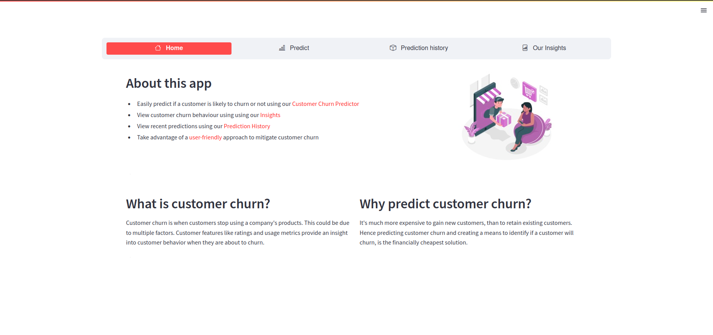
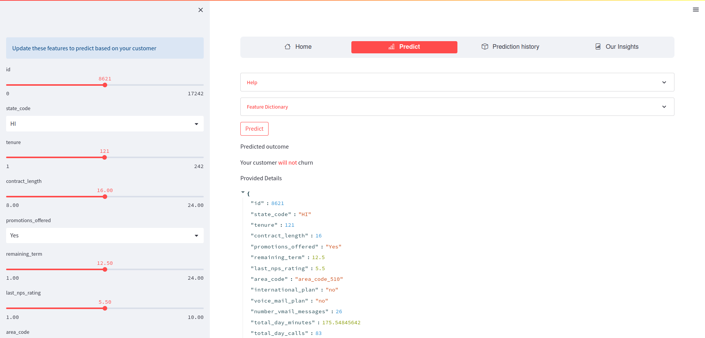
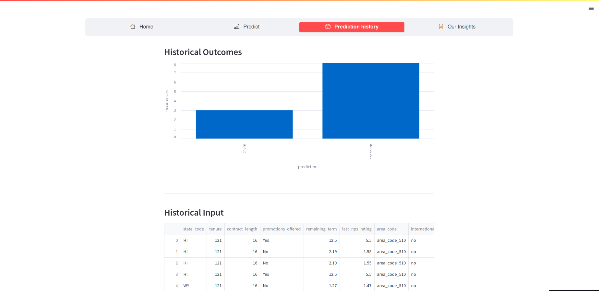
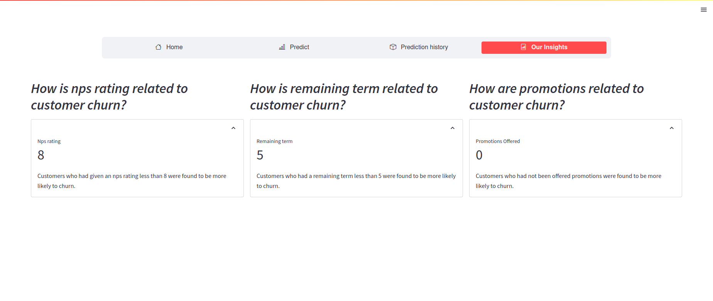

# Customer_Churn
A streamlit app that allows businesses or users to predict customer churn by providing customer features as input. A full-stack machine learning project starting from raw data, EDA to deployment.

# App Overview

# Overview
Customer Churn is a rising challenge faced by companies, where existing customers or users leave the company. This project conducted an in-depth analysis of the features used to predict if a customer will churn from a company. Various insights about the data were obtained using frameworks like pandas and ydta-profiling. EDA was followed by a feature engineering stage, and the data was then ready for modelling using scikit-learn. Since the target classes showed an imbalance, the imblearn package was used to handle the skewed target feature. The performance of 4 models was compared; namely RandomForestRegressor, XGBoost, Gradientboost, and RidgeRegression. The XGBoost model was found to have the comparatively best performance. The model was then deployed using Streamlit, where live predictions can be obtained based on input feature values by the user. 

This project was subitted as part of [Datathon.io](https://devfolio.co/projects/predicting-customer-churn-39f3)
